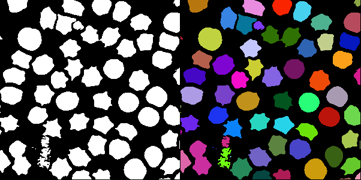

# Torch fast connected component labeling algorithm for CPU

## Algorithm
The connected component algorithm groups and labels adjacent elements in a matrix.
Below is a visualization of how the algorithm works.



## Performance
On the CPU in comparison to Kornia it is **7x faster** (2 cores, Intel(R) Xeon(R) CPU @ 2.20GHz).
The algorithm is definitely slower than the [Kornia](https://pypi.org/project/kornia/) implementation on the GPU.

## Use case
The algorithm is intended for use on the CPU - for example, for models that are to interfere on mobile devices.
The algorithm is worse on GPU than the existing Kornia
 implementation, which is based on max-pooling.
The algorithm uses a plus-shaped kernel.

## Usage
```python
import cv2
import torch

from ccl import label

img = cv2.imread('./assets/cell_binary.png', cv2.IMREAD_GRAYSCALE)
img = torch.tensor(img / 255, dtype=torch.float32)
labeled_tensor, num_features = label(img)
```
